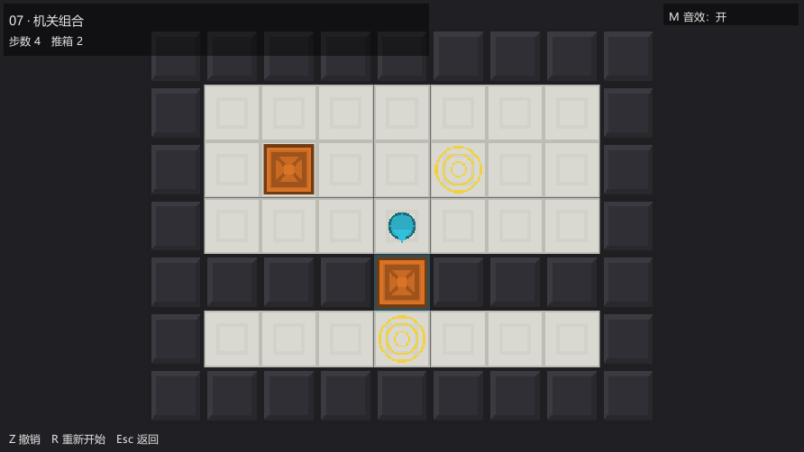
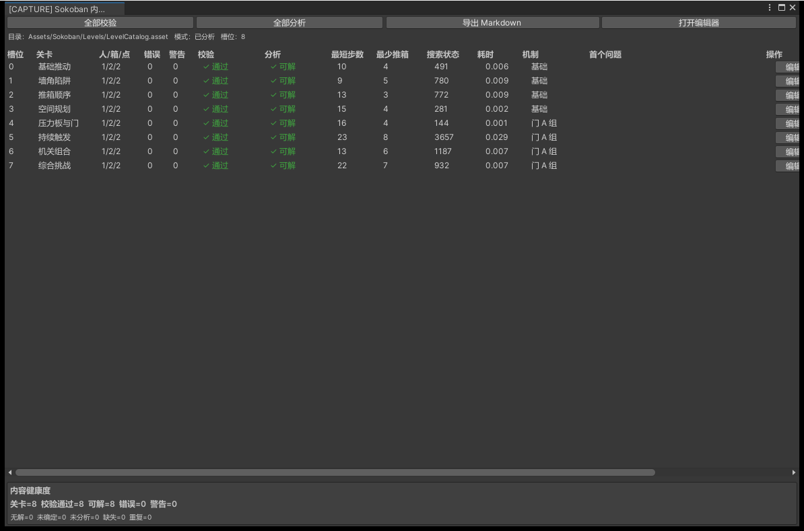
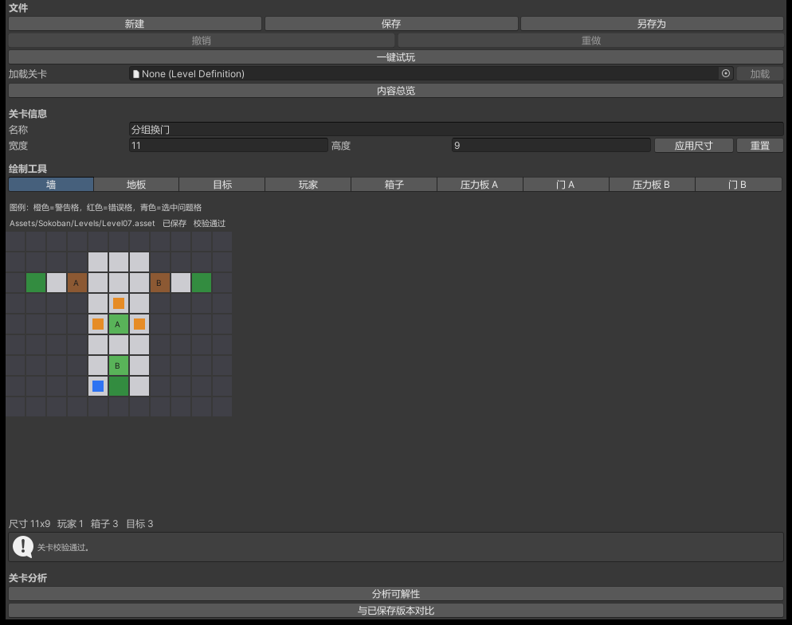
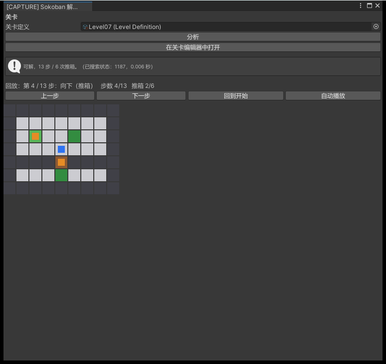
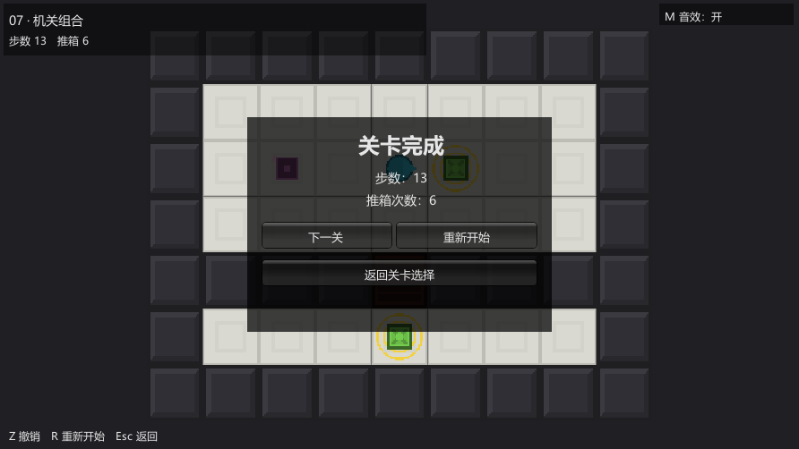

# Sokoban Studio / 推箱子工坊

一个面向关卡设计者的推箱子内容生产工具集：

> 制作 → 校验 → 分析 → 解法预览 → 一键试玩 → 迭代



## 这是什么

Sokoban Studio 是一个 **Unity 技术策划项目**。表面上它是一套完整的推箱子（Sokoban）玩法，但真正被认真对待的问题不是「怎么把箱子推到目标点」，而是：

> 一位关卡设计师做完一个关卡之后，怎么快速知道它有没有问题、可不可解、最短解是什么、能不能直接试玩？

于是项目没有停在「一个能摆格子的编辑器」，而是把它做成了**一条关卡内容生产链**。正式游戏与关卡编辑器共用同一套确定性的运行时规则，设计师在编辑器里通过校验、分析、试玩的关卡，在运行时行为完全一致。

## 一条生产链

```
内容总览  →  找到关卡  →  编辑  →  校验  →  分析  →  看最短解  →  保存  →  一键试玩  →  再迭代
```



每个环节都有对应的工具，而不是只把「画格子」做出来：

| 环节 | 工具 | 作用 |
| --- | --- | --- |
| 内容总览 | Content Dashboard | 只读地展示整个关卡目录的健康状况 |
| 编辑 | Level Editor | 画 / 擦 / 改尺寸 / 撤销重做 / 保存 |
| 校验 | Level Validator | 按严重程度分组：阻断性错误 vs 建议性警告 |
| 分析 | Level Analyzer | 有界 BFS 判定可解性，报告最短解 |
| 解法预览 | Solution Preview | 在独立棋盘上回放最短解，绝不修改资源 |
| 一键试玩 | Playtest | 校验 + 保存 + 用运行时加载器进入 Play Mode |

## 核心能力

- **确定性的 `Board`**：整数网格 + `TryMove` 决定每一次移动与推箱，物理从不决定合法性；动画只是视图。
- **关卡编辑器**：工作副本 + 撤销/重做 + 调整尺寸 + 调色板（墙/地板/目标/玩家/箱子/压力板/门 A·B），校验问题可点击导航到对应格子。
- **校验器**：阻断性错误（箱数≠目标数、占据者落在墙上/门上等）会拦截保存/试玩；静态死角死锁、有门无压力板属于建议性警告。
- **分析器**：仅编辑器可用、有预算上限的广度优先搜索，如实报告 `SOLVABLE / UNSOLVABLE / INCONCLUSIVE`。**预算耗尽绝不等于无解。**
- **解法预览**：独立预览棋盘，不污染 `LevelDefinition` 或工作副本。
- **一键试玩**：跨域重载（domain reload）安全，也能试玩不属于已发行目录的关卡。

## 一个可扩展性案例：压力板 + 门



为了证明这条流水线能承载**新规则**而不只是新瓦片，压力板 + 门被端到端地加了进来（A/B 两组独立联动）。它同时要求 Data、Board、Undo、Validator、Analyzer、Preview、Editor、Dashboard、Runtime、Tests 一起跟着扩展。门状态是**派生**的、从不存储，因此撤销、重新开始与分析器的已访问状态集都自动保持正确。

## 技术要点

- **一套规则，两类使用者**：编辑器与运行时镜像同一套规则（`LevelValidator` / `LevelAnalyzer` vs 运行时 `Board` 加载时强制的不变量），互相吻合。
- **运行时不依赖 `UnityEditor` 或 `AssetDatabase`**；已发行关卡通过显式序列化的 `LevelCatalog` 加载，而非资源发现。
- **运行时从不修改 `LevelDefinition`**。
- 针对 **Unity 2022.3.51f1**（精确版本）构建。

## 验证

- EditMode **196/196 passed**，PlayMode **4/4 passed**（`Verify.ps1 -Tier Gate`）。
- Windows x64 Release 构建通过（`Verify.ps1 -Tier Release`）。
- **8 个已发行关卡**（L01–L08，覆盖入门到压力板/门综合挑战），目录审计 8 条目 / 0 错误 / 0 不可解。

## 截图





## 更多

完整的使用方式、校验规则、分析器判定语义、架构与已知限制见 [README.md](../README.md)；截图总览见 [Screenshots/GALLERY.md](Screenshots/GALLERY.md)。
