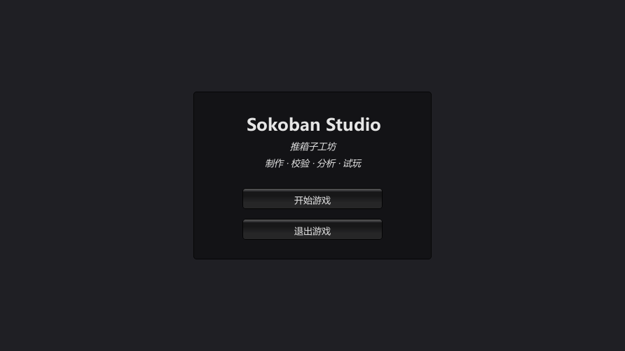
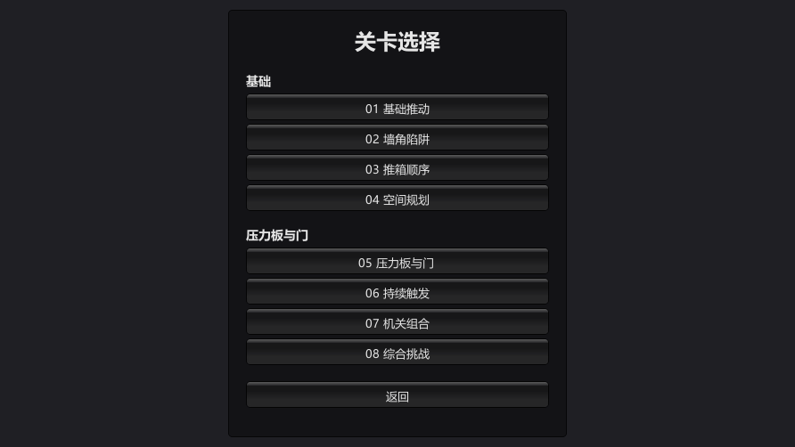
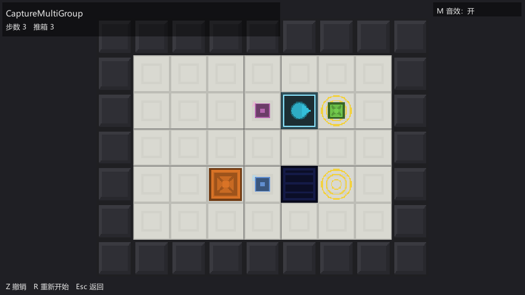
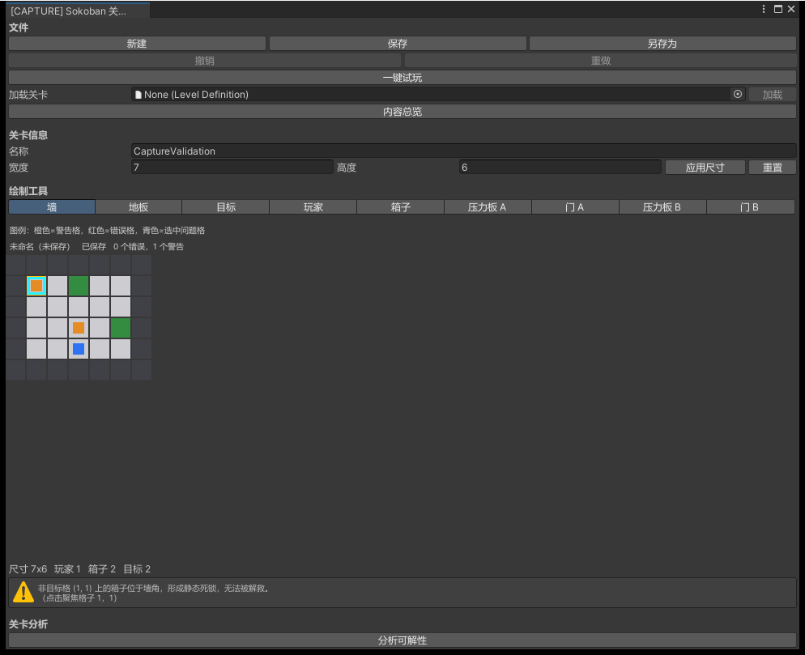
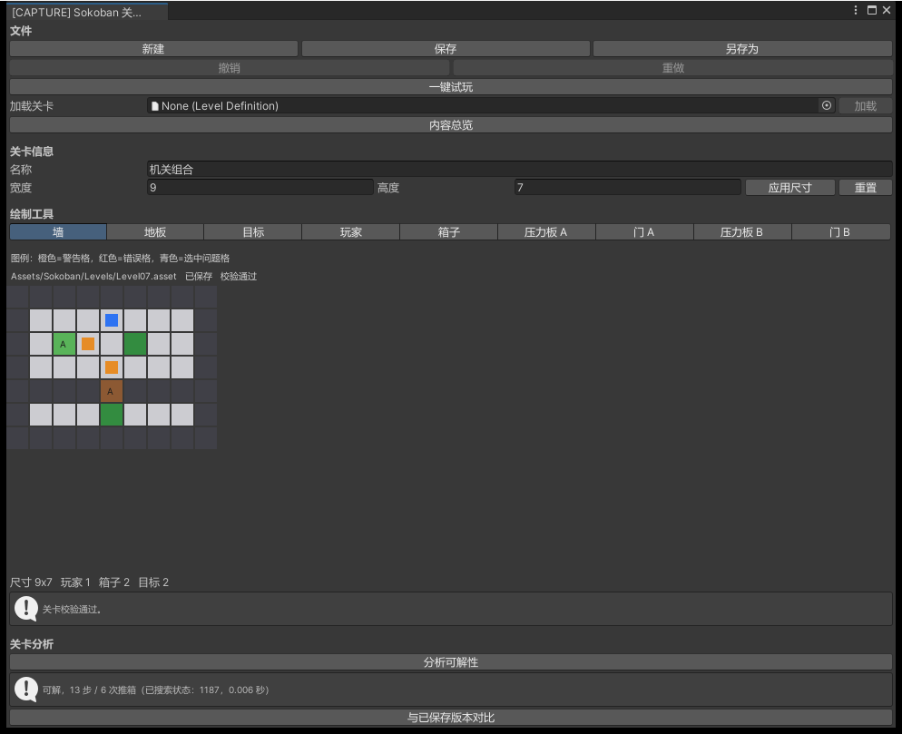

# Screenshot Gallery — 截图总览

自动生成 by `Scripts/Agent/CaptureSubmissionMedia.ps1`；共 10 张稳定文件名截图。

- Generated: 2026-09-21T12:08:54.6465926-06:00

## Runtime

| # | Preview | File | Caption |
|---|---|---|---|
| 1 |  | runtime-main-menu.png | 主菜单 |
| 2 |  | runtime-level-select.png | 关卡选择 |
| 3 |  | runtime-gameplay.png | 游戏实机 |
| 4 |  | runtime-multigroup.png | 多组压力板与门 |
| 5 |  | runtime-complete.png | 关卡完成 |

## Editor

| # | Preview | File | Caption |
|---|---|---|---|
| 1 |  | editor-dashboard.png | 内容总览 |
| 2 |  | editor-level-editor.png | 关卡编辑器 |
| 3 |  | editor-validation.png | 校验与死锁警告 |
| 4 |  | editor-analyzer.png | 分析器 |
| 5 |  | editor-solution-preview.png | 解法预览 |
